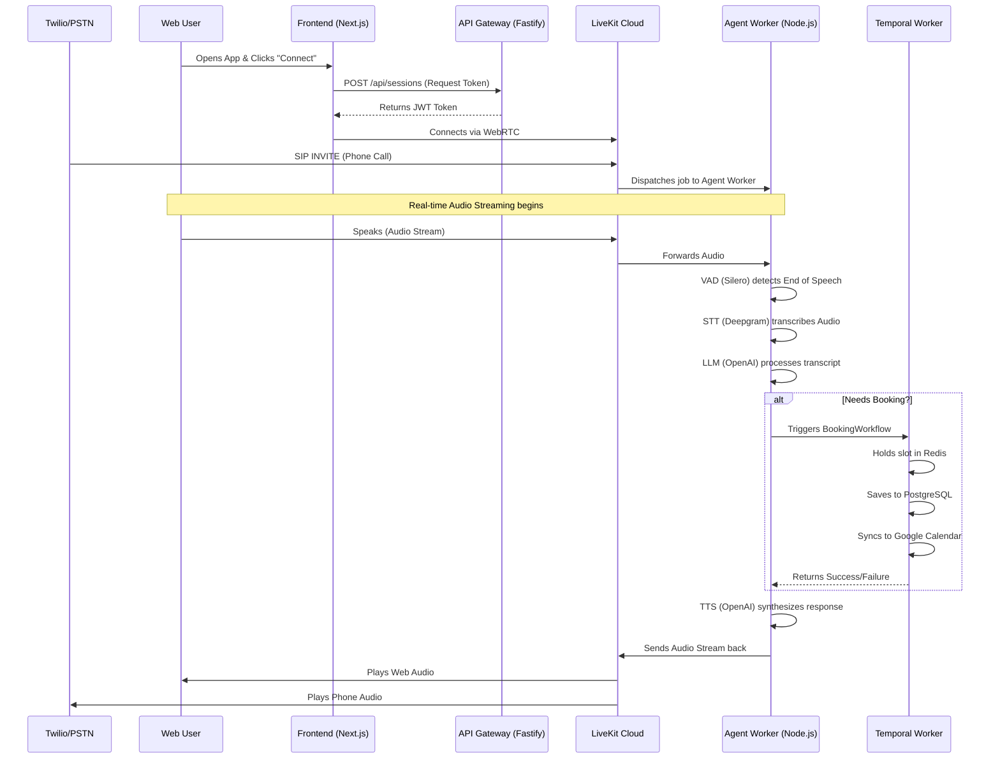

# Voice Agent LiveKit Architecture

A high-performance, real-time voice reservation and agent platform. This monorepo includes shared packages, client applications, backend gateways, and temporal orchestrators.

## Project Structure and Components

This monorepo is organized into three main areas: **Apps** (user-facing and API gateways), **Workers** (background processing and AI execution), and **Packages** (shared business logic and infrastructure clients).

### Apps (`apps/`)
These are the entry points to the system that accept inbound connections from users.
- **`apps/api-gateway/`**: A Fastify REST API. It handles HTTP requests from the frontend, mints secure access tokens for LiveKit sessions, fetches session history, and dispatches cancellation requests to Temporal.
- **`apps/frontend/`**: A Next.js web application. This provides the user interface for end-users to interact with the voice agent. It uses the `@livekit/components-react` library for real-time audio visualization, live transcripts, and WebRTC streaming.

### Workers (`workers/`)
Workers operate in the background and execute the core logic of the system.
- **`workers/agent-worker/`**: The brain of the voice AI. Built on the `@livekit/agents` framework, this Node.js worker connects to LiveKit rooms, processes incoming audio using a Voice Activity Detector (Silero VAD), converts speech to text (Deepgram STT), routes it to an LLM (OpenAI) for decision making/tool execution, and synthesizes the response back to audio (OpenAI/Cartesia TTS).
- **`workers/temporal-worker/`**: The orchestration layer. It runs Temporal workflows and activities to safely execute distributed transactions like checking Google Calendar availability, locking slots via Redis, writing booking records to PostgreSQL, and sending confirmation emails.

### Packages (`packages/`)
Internal shared libraries used by the Apps and Workers.
- **`packages/shared-types/`**: TypeScript interfaces and Zod schemas shared across the stack.
- **`packages/redis-client/`**: Redis utilities for distributed locking, pub/sub communication, config caching, and tracking active voice sessions.
- **`packages/db-client/`**: PostgreSQL client with utilities for Row-Level Security (RLS) and database migrations.
- **`packages/pii-redactor/`**: A utility layer for stripping sensitive Personally Identifiable Information from logs and transcripts before they are persisted.
- **`packages/session-state/`**: State machine logic for managing the lifecycle of a voice agent session.
- **`packages/stt-client/`, `tts-client/`, `llm-client/`**: Legacy streaming API wrappers (largely superseded by the official LiveKit Agents plugins, but maintained for backwards compatibility and custom observability integrations).
- **`packages/eou-detector/`**: Semantic end-of-utterance checking utilities.
- **`packages/observability/`**: OpenTelemetry metrics, tracing integration, and custom logging.

### Infrastructure (`k8s/`, `load-tests/`)
- **`k8s/`**: Kubernetes deployment manifests, including KEDA configurations for autoscaling based on queue length, and preStop hooks for graceful shutdown.
- **`load-tests/`**: k6 scripts designed to simulate high traffic against the API gateway and verify system resilience.

## Architecture Workflow



## Project Status Checklist

### Completed
- [x] **Monorepo Setup:** TurboRepo configured with isolated packages (DB, Redis, Types, Observability).
- [x] **LiveKit Voice Agent:** Node.js agent using `@livekit/agents` framework.
- [x] **Conversational Pipeline:** Deepgram STT -> OpenAI LLM -> OpenAI TTS.
- [x] **Temporal Orchestration:** Saga-based `BookingWorkflow` execution for safety.
- [x] **Google Calendar Sync:** Service Account based free/busy checks, event creation, cancellation/delete sync, and rollback cleanup for failed local writes.
- [x] **Latency Tuning:** Silero VAD min_silence_duration reduced to 300ms.
- [x] **Telephony Integration:** Twilio SIP Inbound Trunks and LiveKit dispatch rules with explicit agent dispatch.
- [x] **WhatsApp Voice Calling:** Twilio Voice webhook validates Twilio signatures, returns TwiML that bridges WhatsApp voice to LiveKit SIP, and reports SIP leg status callbacks.
- [x] **Call Termination:** Agent autonomously hangs up the call using an `endCall` tool upon successful booking confirmation.
- [x] **SIP Parsing Fix:** Overcame Twilio's E.164 parsing bug by ensuring LiveKit Trunk numbers are registered using pure numeric values (e.g. `918591436357`), bypassing `13224` invalid phone number errors.

### Pending / Next Steps
- [ ] **Observability (Langfuse):** Inject Langfuse tracing into the LLM completion streams for analytics.
- [ ] **Post-Call Data Pipeline:** Trigger `PostCallWorkflow` to save full transcripts to PostgreSQL on session end.
- [ ] **Cartesia TTS Re-enable:** Switch back from OpenAI TTS to Cartesia Sonic once billing is resolved.

## Installation

Ensure pnpm is installed globally. Install all dependencies from the root directory:

```bash
pnpm install
```

## Setup Configuration

Create a `.env` file at the root using the provided `.env.example`:

```bash
cp .env.example .env
```

Configure the following environment variables:
- `DATABASE_URL`: PostgreSQL connection string.
- `REDIS_URL`: Redis connection string.
- `TEMPORAL_ADDRESS`: Address of the Temporal cluster.
- `OPENAI_API_KEY`: API key for OpenAI services.
- `DEEPGRAM_API_KEY`: API key for Deepgram speech-to-text.
- `CARTESIA_API_KEY`: API key for Cartesia text-to-speech.
- `LIVEKIT_API_KEY` & `LIVEKIT_API_SECRET`: Credentials for the LiveKit server.
- `LIVEKIT_AGENT_NAME`: Agent name registered by the worker and used by SIP dispatch rules. Defaults to `voice-agent`.
- `LIVEKIT_SIP_URI`: LiveKit SIP URI used by the WhatsApp TwiML bridge.
- `PUBLIC_BASE_URL` or `TWILIO_WEBHOOK_BASE_URL`: Public HTTPS origin for Twilio webhook signature validation and callback URL generation.
- `DEFAULT_TENANT_ID` / `TWILIO_DEFAULT_TENANT_ID`: Tenant UUID used for inbound SIP and WhatsApp calls.

### Google Calendar Setup
To enable Google Calendar syncing, you must configure a Google Service Account:
1. Create a Service Account in Google Cloud Console.
2. Share the target calendar with the Service Account email.
3. Export the JSON key.
4. Set `GOOGLE_SERVICE_ACCOUNT_EMAIL` to the service account email.
5. Set `GOOGLE_PRIVATE_KEY` to the private key. If using a `.env` file, you can wrap the multiline key in double quotes (the system will automatically parse out the quotes and newlines).
6. Set `TARGET_CALENDAR_ID` to your personal email address (e.g. `your-email@example.com`). **Do NOT use `primary`**, otherwise events will be saved to the Service Account's hidden calendar instead of your personal view.
7. For production, set `GOOGLE_CALENDAR_REQUIRED=true` so Calendar API failures fail the booking workflow instead of using local-only development behavior.

When Google Calendar is configured, booking creation writes the Google event first and stores the returned event ID in PostgreSQL. If the local booking insert fails after event creation, the worker deletes the Google event before rethrowing so the two systems do not drift.

### Twilio SIP Setup
The voice agent supports inbound phone calls via Twilio SIP trunking.
1. Set `LIVEKIT_AGENT_NAME`, `TWILIO_DEFAULT_TENANT_ID`, `TWILIO_PSTN_NUMBERS`, and `TWILIO_WHATSAPP_FROM`.
2. Run `pnpm exec tsx scripts/setup-sip.ts` to provision SIP Inbound Trunks and LiveKit dispatch rules.
3. The script creates dispatch rules scoped to each trunk and configures LiveKit to dispatch the named agent into new SIP rooms.
4. In Twilio Console, go to Voice > Manage > SIP Domains.
5. Create a new SIP Domain (e.g., `voice-agent.sip.twilio.com`).
6. Set the Twilio Origination URI to the LiveKit SIP URI.
7. Route your Twilio Phone Number to the new SIP domain.
8. Set `TWILIO_AUTH_TOKEN` so the API gateway validates Twilio signatures. The gateway listens at `/api/v1/webhooks/twilio` for status callbacks.

### WhatsApp Voice Calling Setup
WhatsApp Business Calling for Programmable Voice (launched as General Availability on July 15, 2025) can be integrated by pointing your WhatsApp sender's Voice Webhook URL to the API Gateway. It utilizes the same LiveKit SIP trunking infrastructure.
1. Ensure your Twilio WhatsApp sender is activated for voice capabilities.
2. In the Twilio Console, navigate to your WhatsApp sender configuration.
3. Set `LIVEKIT_SIP_URI`, `TWILIO_WEBHOOK_BASE_URL` or `PUBLIC_BASE_URL`, `TWILIO_AUTH_TOKEN`, `TWILIO_DEFAULT_TENANT_ID`, and `TWILIO_WHATSAPP_FROM`.
4. Set the sender's **Voice Webhook URL** to `https://<your-domain>/api/v1/webhooks/twilio/whatsapp-voice`.
5. When a user calls your WhatsApp number, Twilio invokes this webhook. The API gateway validates the Twilio signature, persists inbound call metadata when a default tenant is configured, and returns TwiML containing a `<Sip>` noun with `initiated ringing answered completed` status callbacks.
6. For production confirmation messages, set `TWILIO_WHATSAPP_REQUIRED=true` so Twilio send failures fail the workflow instead of being treated as simulated local development sends.

## Building the Workspace

Compile all typescript packages and applications:

```bash
pnpm -r build
```

## Running the Applications Locally

1. Start database, cache, and orchestrator dependencies:
   Ensure PostgreSQL, Redis, and Temporal are active.

2. Start the Temporal Worker:
   ```bash
   pnpm --filter @voice-agent/temporal-worker start
   ```

3. Start the API Gateway:
   ```bash
   pnpm --filter @voice-agent/api-gateway start
   ```

4. Start the Next.js Client Frontend:
   ```bash
   pnpm --filter @voice-agent/frontend dev
   ```

## Running Validation Tests

### E2E Validation
Verify the entire system end-to-end including database migrations, package audits, API gateway integration, and Temporal workflows:

```bash
pnpm validate
```

### Focused Vendor Integration V&V
Run focused validation for Twilio/WhatsApp webhook behavior, Google Calendar API boundary behavior, and Temporal booking saga compensation:

```bash
pnpm --filter @voice-agent/api-gateway build
pnpm --filter @voice-agent/temporal-worker build
pnpm --filter @voice-agent/agent-worker build
pnpm exec tsc --noEmit --pretty false --esModuleInterop --skipLibCheck scripts/setup-sip.ts
pnpm exec vitest run --config tests/v_and_v/vitest.config.ts tests/v_and_v/unit/vendor-integrations.test.ts
pnpm exec vitest run --config tests/v_and_v/vitest.config.ts tests/v_and_v/integration/booking-saga.test.ts
```

The `tests/v_and_v/integration/api-gateway.test.ts` suite uses testcontainers and requires a working local container runtime.

### Load Testing
Execute the k6 simulation suite to verify HTTP gateway throughput and cancellation dispatch:

```bash
k6 run load-tests/booking-load-test.js
```

### Chaos Testing
Verify the kubernetes preStop call-draining hook using the chaos test script:

```bash
./load-tests/chaos-test.sh
```
